# Segundo Sprint: Uso de docker y mejora de la estrategia de pruebas (12 puntos)
## Objetivos
- Contenerización del sistema: Utilizar Docker para contenerizar la aplicación y asegurar su
portabilidad.
- Refinamiento del tDD: Continuar utilizando TDD para cualquier nueva funcionalidad o
mejora.
- Mejora de la estrategia de pruebas: Integrar la estrategia de pruebas en un entorno
Dockerizado.
- Refactorización y código limpio: Continuar refactorizando el código para mantener su
calidad.
- Métricas de calidad: Continuar monitoreando y mejorando las métricas de calidad del
código.

### Implementare las funciones que no hice en el sprint 1 y agregare pruebas pero antes con lo trabajado usare docker:

### 1. Contenerización del Sistema:
Crear un Dockerfile para construir la imagen de la aplicación.

Inicializo el docker

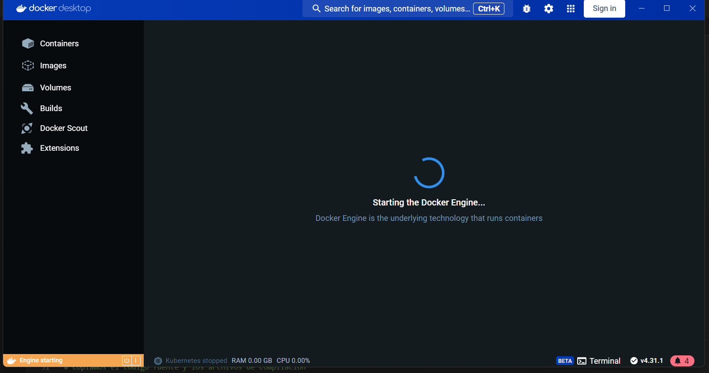

Escribo el Dockerfile y lo pongo a nivel del proyecto.

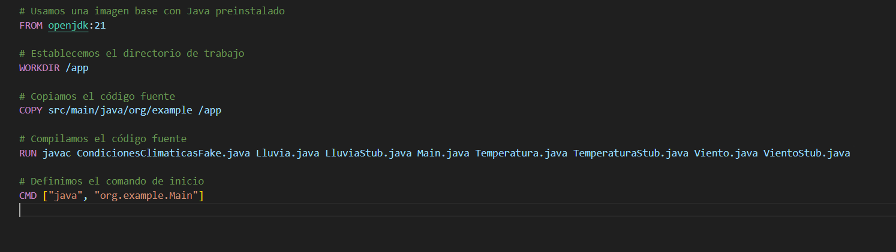

Para el Run usare javac y mas adelante intentare con el gradlew que enseño el domingo:

Usare el comando `docker build -t examen-final .`

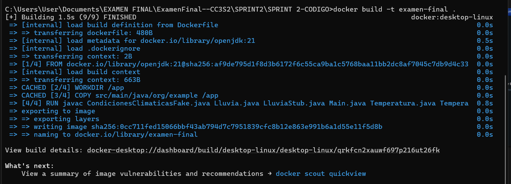

Usare un contenedor para probar que la imagen se ha construido de manera adecuada y reconoce todas mis clases, para ello uso el comando: `docker run -it --name examen-final examen-final`

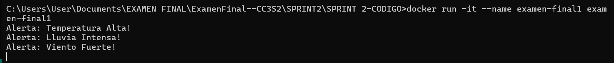

No hay errores, pues la compilacion es correcta, significa que las pruebas implementadas hasta el sprint 1 son correctas, esto sera mi referente para las futuras implmentaciones.

Configurar un docker-compose.yml si se necesitan múltiples servicios (bases de datos, servicios de simulación de clima).

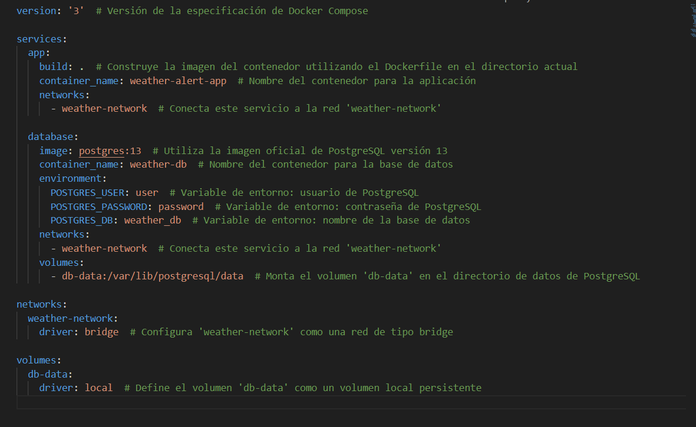

Para database (aunque ciertamente no se implementara en esta ocasion) utilizare la imagen oficial de PostgreSQL versión 13 (postgres:13) ya que he hecho algunso trabajos antes aca,se configura las variables de entorno (POSTGRES_USER, POSTGRES_PASSWORD, POSTGRES_DB) necesarias para inicializar la base de datos PostgreSQL. También se conecta a la red weather-network y monta el volumen db-data en el directorio de datos de PostgreSQL para persistencia de datos.

Utilizo el comando `docker-compose up -d`

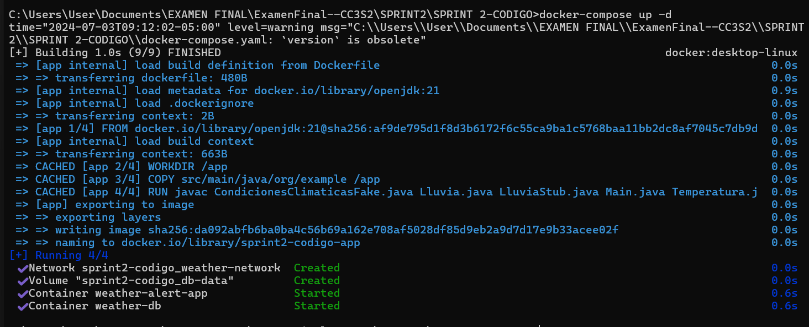

### 2. Refinamiento del TDD:
- Escribir nuevas pruebas para cualquier funcionalidad adicional.

- Asegurar que todas las pruebas existentes pasen en el entorno Dockerizado.

Como ya lo mencione en el entorno todo esta correcto.

Agregare algunas mejoras al codigo que se hizo en el sprint 1, en la clase Main hice una pequeña modificacion, para que el usuario sea el que interactue con la consola y pueda dar valores de lluvia, temperatura y viento:

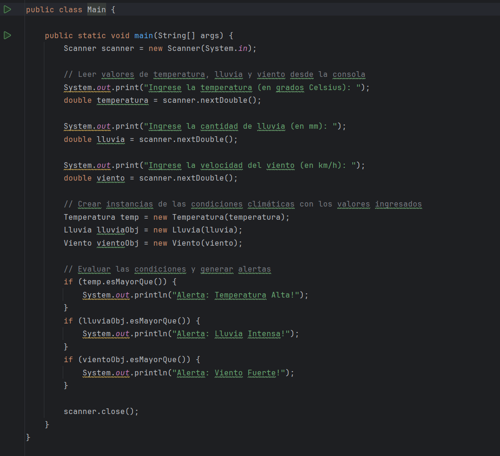
Son cambios simples pero igual los comento:

- Se utiliza Scanner para leer los valores de temperatura, lluvia y viento directamente desde la consola.
- Cada valor se imprime con un mensaje indicando qué se espera que ingrese el usuario.
- Después de leer los valores, se crean las instancias correspondientes de Temperatura, Lluvia y Viento.
- Luego se evalúan estas instancias para determinar si se deben generar alertas según las condiciones climáticas ingresadas.

Y la ejecucion:

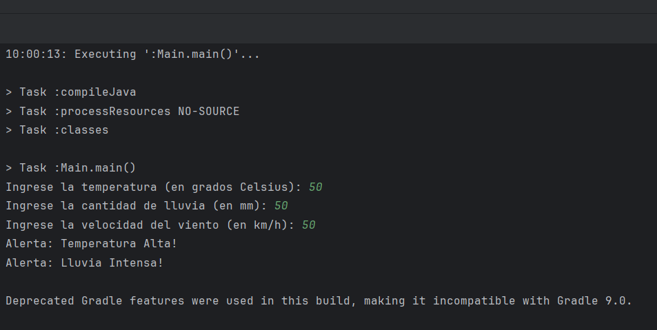

Para verlo en el contenedor simplemente actualizo la imagen "examen-final" con un build y luego ejecuto con un run, sin embargo hay una variacion para poder interactuar con la consola despues de correr el contenedor se usa el commando : `docker run --tty --interactive examen-final1`:

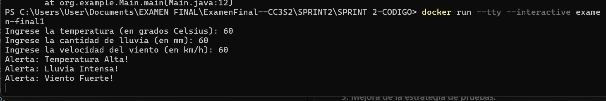

y vemos que compila correctamente.

Ahora en el sprint 1 omiti:

 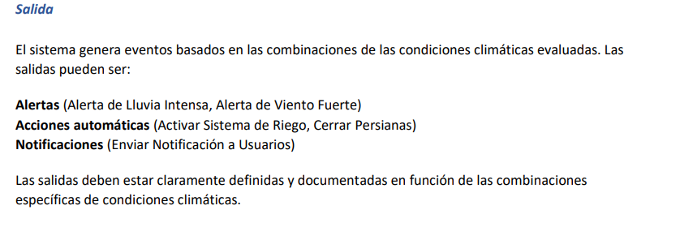

 Por lo que: 

Voy a modificar las Clases de Condiciones Climáticas:

En cada una de las clases Temperatura, Lluvia y Viento, agregare un nuevo atributo valorMinimo que represente el umbral mínimo para activar eventos específicos.

Y agregare un parametro int en el metodo esMayorque

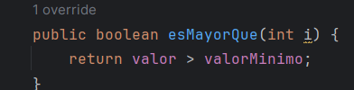

Lo mismo para las otras clases.Ahora implementare la clase `Eventos`, 

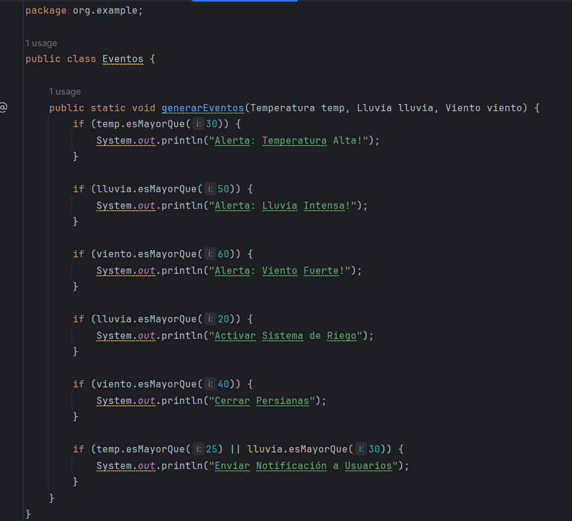

La clase Eventos contiene un método estático llamado generarEventos que toma como parámetros tres objetos que implementan la interfaz CondicionClimatica: temperatura, lluvia y viento. Este método evalúa cada condición climática para determinar si superan ciertos umbrales y, en función de estos, genera alertas y acciones específicas. Estas acciones incluyen imprimir alertas sobre condiciones climáticas peligrosas, activar un sistema de riego, cerrar persianas y enviar notificaciones a los usuarios.

Ahora tendria que modificar el Main: 

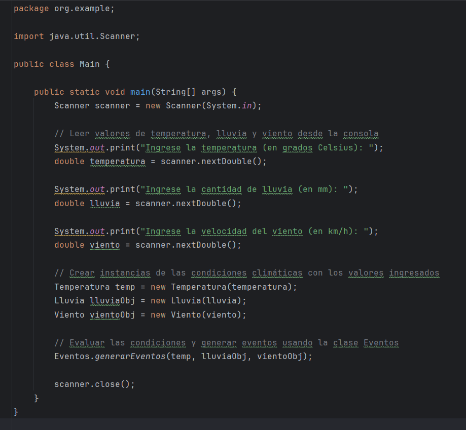

`Eventos.generarEventos()` es responsable de evaluar las condiciones climáticas y generar las alertas según los umbrales definidos en las clases Temperatura, Lluvia y Viento.

Hacerlo de esta manera, permite mantener que mi main sea mas limpio y modular, delegando la lógica de generación de eventos a la clase Eventos, lo cual facilita la gestión y ampliación de funcionalidades relacionadas con las condiciones climáticas en esta aplicación.

Para esta parte la compilacion se ve asi:

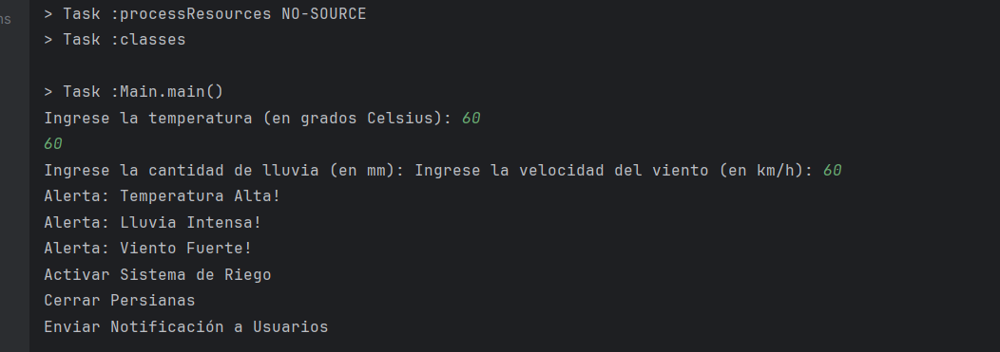

Y ahora agregare un test para esta nueva clase:

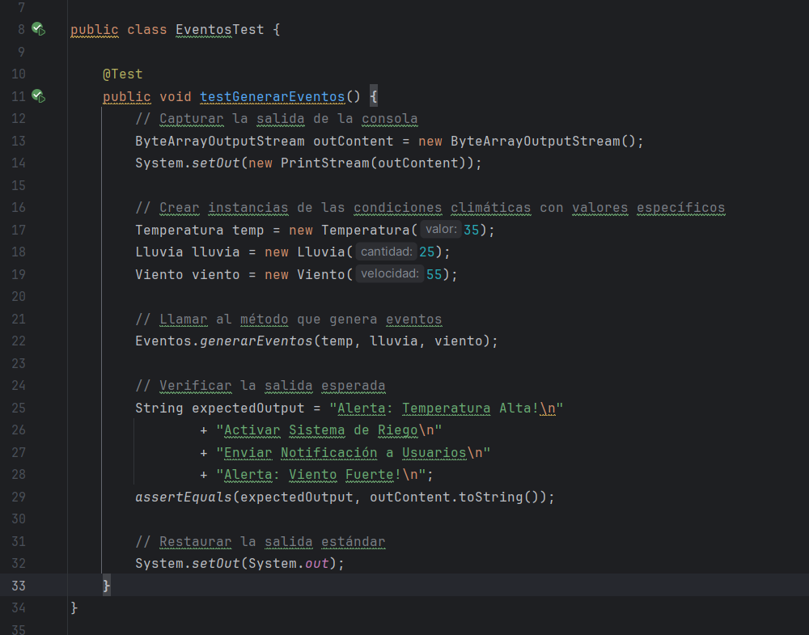

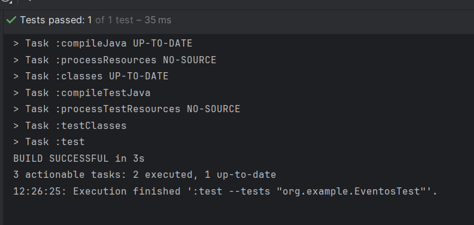

El test verifica que el método generarEventos genera las alertas y acciones correctas basadas en las condiciones climáticas proporcionadas. Captura la salida de la consola, compara con la salida esperada, y asegura que todas las alertas y acciones se generen correctamente. También restaura la salida estándar de la consola al final.

### 3. Mejora de la estrategia de pruebas:
Integrar las pruebas unitarias y de integración en el pipeline de Docker.
Asegurar que los stubs y fakes funcionen correctamente en el entorno
contenerizado.

En esta parte modificare mi dockerfile de la siguiente manera:

Cambié el javac, ahora da permisos de ejecución al script de Gradle y compila el proyecto: `RUN chmod +x ./gradlew && ./gradlew build` (como fue explicado en la recuperacion), esto se hace para poder interactuar con el contenedor y poder verificar si los test funcionan en el entorno dockerizado:

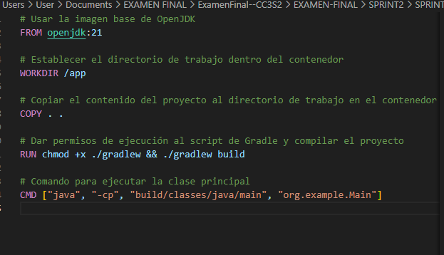

Hago el build de la imagen:

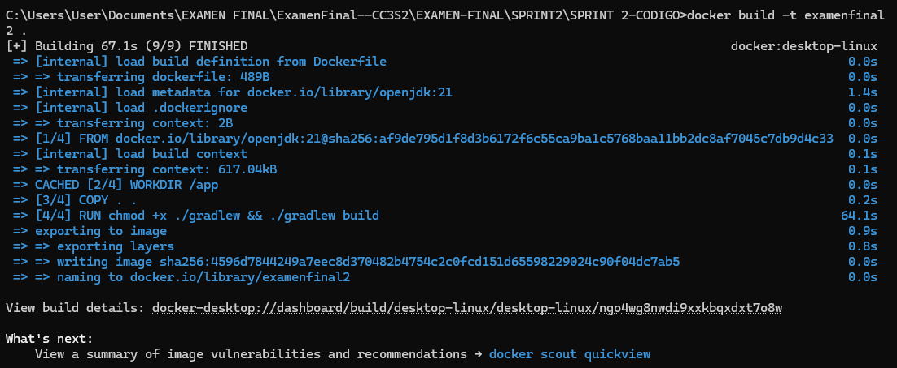

Y ahora puedo correr un contenedor con esta imagen, lo hare en modo interactivo:

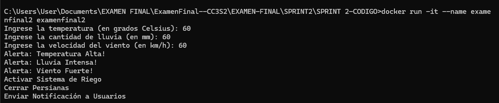

Las clases estan funcionando correctamente, ahora intentare verificar desde el contenedor que no hay problemas con los test:

`docker run --rm -it examenfinal2 ./gradlew test`

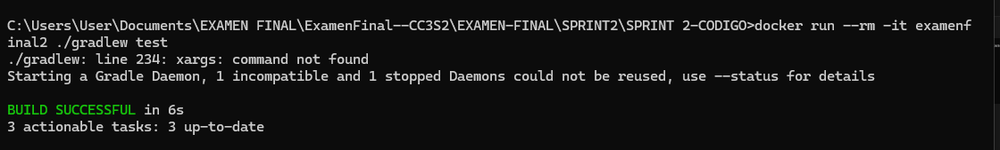

Parece que el comando ./gradlew build se ejecutó correctamente dentro del contenedor Docker, ya que la salida muestra BUILD SUCCESSFUL. Sin embargo, el mensaje ./gradlew: line 234: xargs: command not found indica que xargs no está disponible en el contenedor. Esto no afectó la ejecución de Gradle, pero para una instalación más completa, sería bueno tener xargs disponible, dado que no me genera un inconveniente lo dejare asi como esta

### 4. Refactorización y código limpio:
Continuar refactorizando el código para mejorar la calidad y mantener la adherencia
a los principios de diseño limpio.

Puedo separar la funcionalidad común de las clases Lluvia, Viento y Temperatura en una interfaz, ya que todas estas clases tienen métodos y comportamientos similares. Esto ayudará a mantener el código más limpio y organizado.

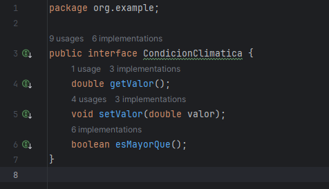

Luego mofico las demas clases para implementar esta interfaz:

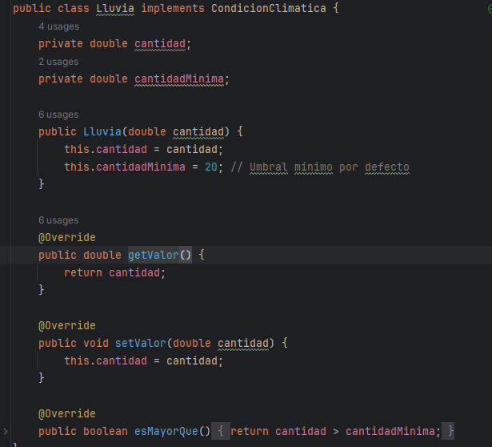

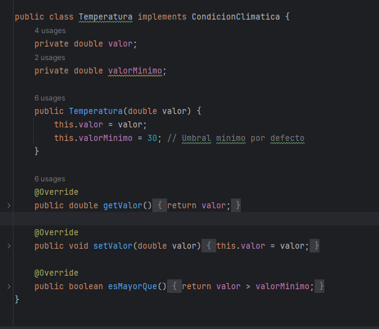

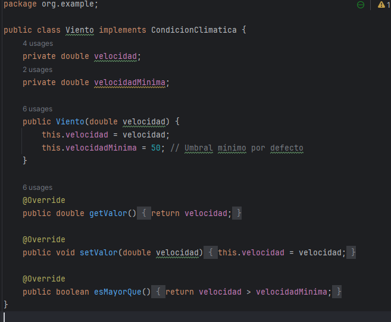

Dado que modifique mis clases tambien modifique mis Stubs y mi Fake, y ahora es asi: 

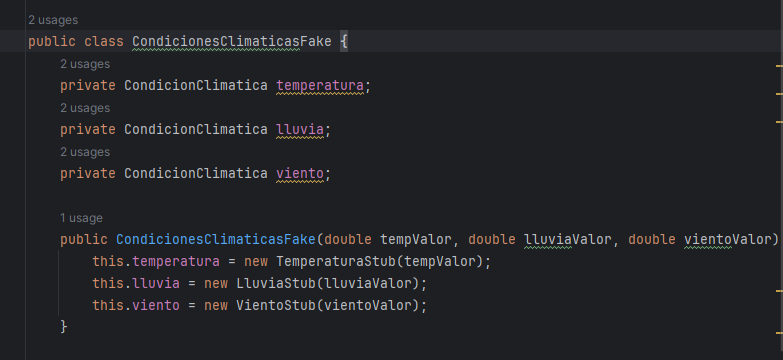
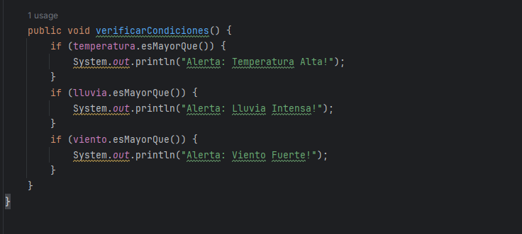

Y modifique el test: 
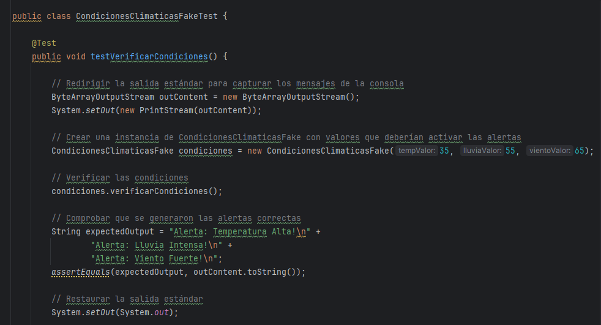
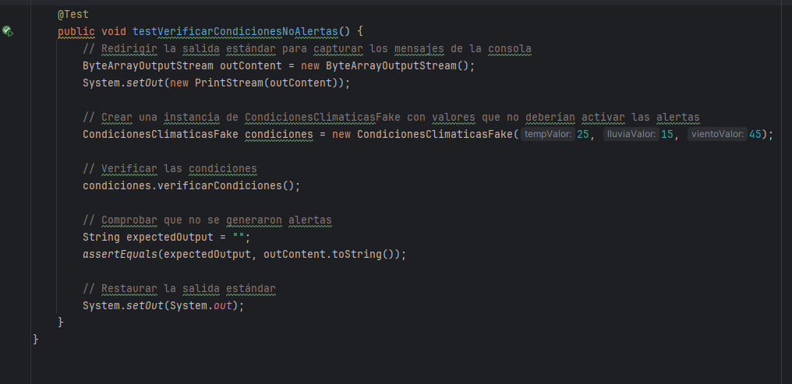

- testVerificarCondiciones: Se crean condiciones que deberían activar todas las alertas y se verifica que la salida de la consola contenga los mensajes de alerta esperados.
- testVerificarCondicionesNoAlertas: Se crean condiciones que no deberían activar ninguna alerta y se verifica que la salida de la consola esté vacía.

Con estas pruebas, se valida   que CondicionesClimaticasFake funciona correctamente, generando alertas según los valores de las condiciones climáticas proporcionadas.

### 5. Métricas de Calidad:
Monitorear la cobertura de pruebas y la complejidad del código en el entorno
Dockerizado.
Utilizar herramientas de análisis de código para asegurar la calidad

Dado que se puede usar los comandos de gradle en nuestro contenedor es sencillo hacer esta prueba, basta con recordar el comando de gradle para Jacoco y pitest que son: `./gradlew pitest` y `./gradlew jacocoTestReport`

`docker run --rm -it examenfinal2 ./gradlew test`

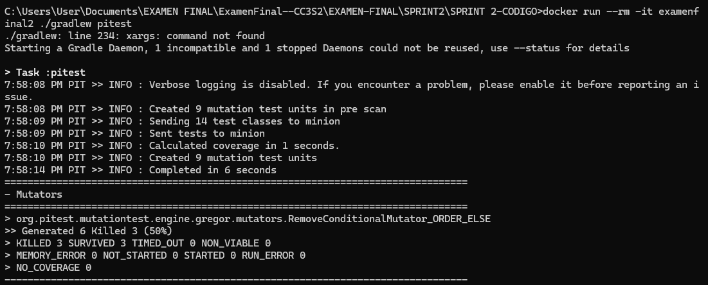
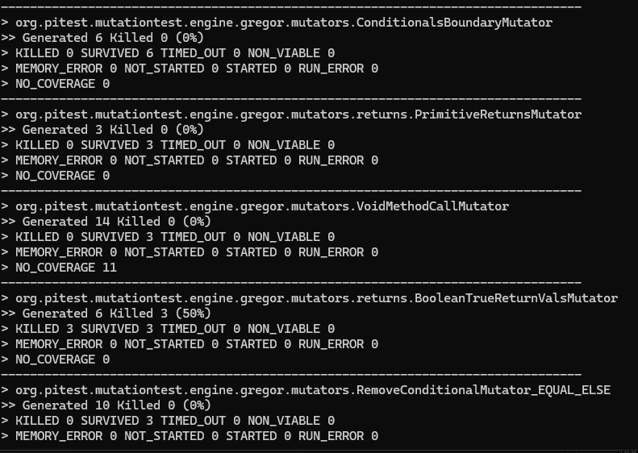
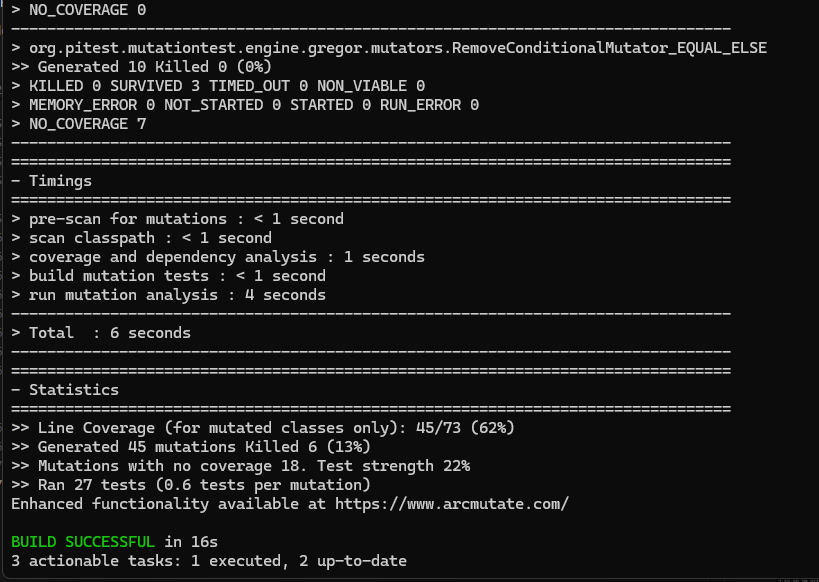

Vemos que pitest compila correctamente, lo que es otro indicador que las pruebas que hice con fakes y stubs estan pasando correctamente.

Ahora probare con Jacoco:

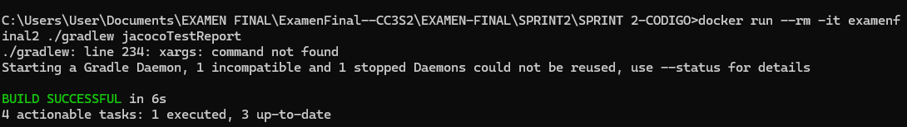

Puedo ver los archivos que genera el pitest, por ejemplo, usando este comando: `docker cp examenfinal2:/app/build/reports/pitest ./pitest-reports`

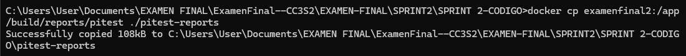

Este comando copia el directorio de informes de Pitest desde el contenedor al directorio actual de mi sistema host, con esto me aseguro de que los informes de Pitest sean accesibles y revisarlos fuera del contenedor Docker.

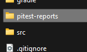

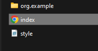

Reporte de las pruebas de mutacion:

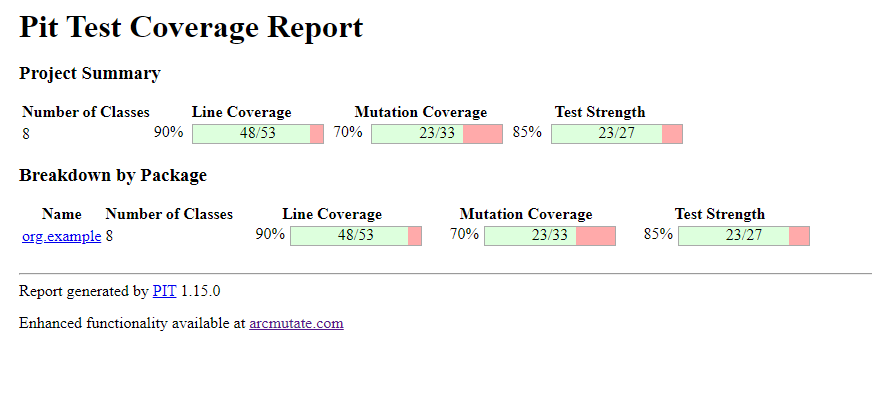